# Streamline — AI-Powered Personal Productivity OS

<div align="center">

[](https://opensource.org/licenses/MIT)
[](https://nodejs.org/)
[](https://nextjs.org/)
[](https://neon.tech/)
[](https://ai.google.dev/)
[](https://bullmq.io/)

**An autonomous, unified personal operating system aggregating multi-account Gmail, Google Calendar, and AI-driven workflow intelligence into a single sub-second dashboard.**

[Explore Documentation](./docs/README.md) · [Architecture Overview](./docs/architecture/system-overview.md) · [REST API Specs](./docs/api/endpoints.md) · [Developer Setup](./docs/development/setup-guide.md)

</div>

---

## ⚡ Executive Overview

**Streamline** eliminates email fragmentation and context switching by unifying multiple Google Workspace accounts into a single high-performance feed. Powered by **Google Gemini Foundation Models**, Streamline triages incoming messages in real-time, extracts action items into official tasks, drafts contextual replies in sub-second streams, and delivers synthesized daily executive digests.

```mermaid
graph TD
    subgraph MultiAccount ["Multi-Account Ingestion"]
        G1["Work Gmail & Calendar"]
        G2["Personal Gmail & Calendar"]
        G3["University / Org Mail"]
    end

    subgraph SyncCore ["Streamline Async Core"]
        AES["AES-256-GCM Token Vault"]
        BullMQ["BullMQ Queue Engine (Redis)"]
        NeonDB[("Neon Serverless Postgres")]
    end

    subgraph GeminiAI ["Gemini Intelligence Layer"]
        Triage["Real-Time Triage (P1-P4)"]
        Drafter["Streaming Reply Drafter"]
        Digest["Daily Executive Digest"]
        Radar["AI Task Extraction Radar"]
    end

    subgraph UnifiedOS ["Streamline Personal OS"]
        Inbox["Unified Inbox & Thread Viewer"]
        Agenda["Integrated Calendar & Agenda"]
        Tasks["Action Item Task Manager"]
    end

    G1 & G2 & G3 --> AES --> BullMQ --> NeonDB
    NeonDB --> Triage & Drafter & Digest & Radar
    Triage & Drafter & Digest & Radar --> Inbox & Agenda & Tasks
```



---

## ✨ Core Features

### 📬 1. Unified Multi-Account Inbox
* **Consolidated Feed**: Aggregate emails from unlimited Google accounts in one synchronized view.
* **Account Badging**: Clean, color-coded mailbox pills identifying sender domains and accounts.
* **Offline Cache & Instant Search**: Redis-backed L1 caching for sub-millisecond query responses.

### 🧠 2. Gemini Autonomous Intelligence Pipeline
* **Multi-Model Cascade Engine**: Sub-second triage utilizing `gemini-3.5-flash-lite` (~680ms) with automated fallbacks to `gemini-3.6-flash`.
* **Live Priority Badging**: Real-time semantic categorization:
  * `🔥 P1 Action`: Urgent deadlines and actionable requests.
  * `💬 P2 Direct`: 1-on-1 human conversations.
  * `🔔 P3 Updates`: Notifications, security alerts, and system policies.
  * `📰 P4 News`: Subscriptions, digests, and newsletters.
* **Smart Topic Tagging**: Semantic cluster pills (`🎓 Academics`, `🚀 Tech & AI`, `💼 DevClub`, `👥 Community`).
* **Streaming Reply Drafter**: Instant contextual reply drafting with tone modulation (*Professional*, *Friendly*, *Concise*, *Custom Prompt*).
* **Daily Executive Digest**: Daily morning briefing synthesizing 24-hour newsletters and action items into a clean magazine-style dashboard.

### 🛡️ 3. Bank-Grade Security & Privacy
* **AES-256-GCM Encryption at Rest**: All Google access and refresh tokens are encrypted using individual initialization vectors and cryptographic authentication tags.
* **Zero Public Token Exposure**: Strict repository sanitization guarantees credentials are never exposed to browser APIs.
* **OAuth 2.0 with PKCE**: `S256` code challenges and cryptographically signed state validation.
* **Double-Submit CSRF & Rate Limiting**: Protection across state-changing endpoints with IPv4/IPv6 normalization.

---

## 🏗 Technology Stack

| Layer | Technologies |
| :--- | :--- |
| **Frontend UI** | Next.js 15 (App Router), React 19, TypeScript, Tailwind CSS, Lucide Icons |
| **Backend API** | Express.js, TypeScript, Zod validation, Pino Logger |
| **AI Intelligence** | Google Gen AI SDK (`@google/genai`), Gemini 3.5 Flash-Lite, Gemini 3.6 Flash |
| **Background Processing** | BullMQ 5.x, Redis (ioredis), Cron Schedulers |
| **Database & ORM** | Neon Serverless PostgreSQL, Drizzle ORM |
| **Security & Auth** | AES-256-GCM, Bcrypt, JWT (`httpOnly` cookies), Double-Submit CSRF |

---

## 📚 Complete Documentation Suite

For detailed technical references, explore the dedicated documentation suite in the [`/docs`](./docs/README.md) directory:

* 🗺️ [**Documentation Index**](./docs/README.md)
* 📐 [**Architecture & System Overview**](./docs/architecture/system-overview.md)
* 🗄️ [**Database Architecture & Schema**](./docs/architecture/database-schema.md)
* 🤖 [**Gemini AI Intelligence Pipeline**](./docs/ai/gemini-pipeline.md)
* 🔄 [**Sync Engine & BullMQ Workers**](./docs/sync/engine-and-workers.md)
* 🔐 [**Security, Authentication & Token Encryption**](./docs/security/auth-and-encryption.md)
* 🌐 [**REST API Specification**](./docs/api/endpoints.md)
* 🛠️ [**Developer Setup & Deployment Guide**](./docs/development/setup-guide.md)

---

## 🚀 Quick Start Guide

### 1. Clone & Install Dependencies
```bash
git clone https://github.com/PiyushY111/Streamline.git
cd Streamline
npm install
```

### 2. Configure Environment Variables
Generate an AES encryption key and copy the template:
```bash
node -e "console.log(require('crypto').randomBytes(32).toString('hex'))"
cp .env.example .env
```
Fill in your `DATABASE_URL` (Neon Postgres), `GEMINI_API_KEY`, and Google OAuth credentials.

### 3. Run Database Migrations
```bash
npm run db:push --workspace=@streamline/server
```

### 4. Start Development Servers
```bash
# Start backend server & background sync workers
npm run dev --workspace=@streamline/server

# In a separate terminal, start Next.js frontend
npm run dev --workspace=@streamline/client
```

Open **`http://localhost:3000`** in your browser.

---

## 🧪 Verification & Tests

```bash
# Run Vitest test suite
npm test --workspace=@streamline/server

# Run TypeScript type verification
npm run type-check --workspace=@streamline/client
npm run type-check --workspace=@streamline/server
```

---

## 📄 License

Distributed under the **MIT License**. See `LICENSE` for more information.
