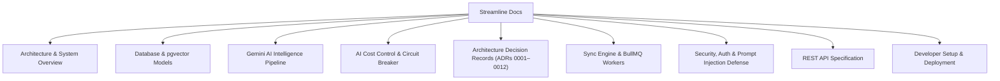

# Streamline Documentation

Welcome to the comprehensive technical documentation for **Streamline** — the Autonomous AI-Powered Personal Productivity Operating System.

---

## 🗺️ Documentation Index

| Section | Document | Description |
| :--- | :--- | :--- |
| **01. System Architecture** | [Architecture & System Overview](./architecture/system-overview.md) | High-level topology, Monorepo layout, Service decomposition, ReAct Agent Orchestrator, and Caching layer. |
| **02. Database Architecture** | [Database Schema & Models](./architecture/database-schema.md) | Neon Serverless PostgreSQL schema, `pgvector` HNSW index design, Drizzle ORM entity definitions, and ER diagrams. |
| **03. AI Intelligence** | [Gemini AI Intelligence Pipeline](./ai/gemini-pipeline.md) | Real-time email triage, Action Item radar, Streaming reply drafter, and Daily Executive Digest synthesis. |
| **04. AI Cost Control & Guard** | [Cost Control & Circuit Breaker](./ai/cost-control-and-circuit-breaker.md) | Token tracking per user, per-model USD cost calculation, and autonomous budget circuit breaker. |
| **05. Decision Records** | [Architecture Decision Records (ADRs)](./adr/README.md) | Comprehensive ADR index (ADR-0001 to ADR-0012) covering queues, encryption, memory vault, policy boundary, and prompt injection defense. |
| **06. Sync & Queues** | [Sync Engine & BullMQ Workers](./sync/engine-and-workers.md) | Google Workspace synchronization pipeline, Token rotation, BullMQ background queues, and schedulers. |
| **07. Security & Auth** | [Security, Auth & Encryption](./security/auth-and-encryption.md) | AES-256-GCM token encryption at rest, OAuth 2.0 PKCE, CSRF protection, and policy-layer prompt injection defense. |
| **08. API Reference** | [REST API Specification](./api/endpoints.md) | Complete REST API endpoint reference, payload contracts, headers, status codes, agent streaming, and memory endpoints. |
| **09. Developer Guide** | [Developer Setup & Deployment](./development/setup-guide.md) | Local environment setup, Google Cloud Console configuration, database migrations, and testing. |

---

## 🏗 High-Level Architectural Highlights

* **Frontend**: Next.js 15 (App Router), React 19, TypeScript, Tailwind CSS, Radix UI, Zustand, TanStack Query, and Server-Sent Events (SSE).
* **Backend API & Workers**: Express.js 5 REST API, BullMQ 5.x async job queues, Redis, and cron-based schedulers.
* **Database & Vector Store**: Neon Serverless PostgreSQL with Drizzle ORM, connection pooling, and `pgvector` for semantic memory retrieval.
* **ReAct Agent Orchestrator**: Multi-turn agent with tool execution (`get_email`, `send_email`, `create_calendar_event`, `create_task`, `save_memory`), thought signatures, and dual-boundary human-in-the-loop pending action approvals.
* **Prompt Injection Defense**: Structural isolation with `<untrusted_external_content>` wrapping, delimiter neutralization, and interactive penetration testing lab.
* **Observability**: OpenTelemetry-compliant trace assembler producing waterfall timelines, model vs. tool latency breakdown, and live SSE trace streams.
* **Task & Agenda Engine**: DAG dependency resolution with cycle detection, exponential urgency decay scoring, and Google Calendar free-slot discovery.
* **Security**: AES-256-GCM symmetric encryption for OAuth tokens at rest, `httpOnly` secure cookies, double-submit CSRF tokens, secret redactors, and zero token exposure over public APIs.
* **Automated Evals**: Scenario-based evaluation harness (`evals/run-all.ts`) testing priority triage, tool dispatch, retrieval precision, and injection resistance.
