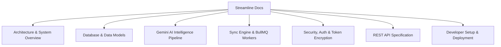

# Streamline Documentation

Welcome to the comprehensive technical documentation for **Streamline** — the Autonomous AI-Powered Personal Productivity Operating System.

---

## 🗺️ Documentation Index

| Section | Document | Description |
| :--- | :--- | :--- |
| **01. System Architecture** | [Architecture & System Overview](./architecture/system-overview.md) | High-level topology, Monorepo layout, Service decomposition, Request lifecycle, and Caching layer. |
| **02. Database Architecture** | [Database Schema & Models](./architecture/database-schema.md) | Neon Serverless PostgreSQL schema, Drizzle ORM entity definitions, relationships, and ER diagrams. |
| **03. AI Intelligence** | [Gemini AI Intelligence Pipeline](./ai/gemini-pipeline.md) | Real-time email triage, Action Item radar, Streaming reply drafter, and Daily Executive Digest synthesis. |
| **04. Sync & Queues** | [Sync Engine & BullMQ Workers](./sync/engine-and-workers.md) | Google Workspace synchronization pipeline, Token rotation, BullMQ background queues, and schedulers. |
| **05. Security & Auth** | [Security, Auth & Encryption](./security/auth-and-encryption.md) | AES-256-GCM token encryption at rest, OAuth 2.0 PKCE, CSRF protection, and sanitization protocols. |
| **06. API Reference** | [REST API Specification](./api/endpoints.md) | Complete REST API endpoint reference, payload contracts, headers, and status codes. |
| **07. Developer Guide** | [Developer Setup & Deployment](./development/setup-guide.md) | Local environment setup, Google Cloud Console configuration, database migrations, and testing. |

---

## 🏗 High-Level Architectural Highlights

* **Frontend**: Next.js 15 (App Router), React 19, TypeScript, Tailwind CSS, Lucide Icons, and Server-Sent Events (SSE).
* **Backend API & Workers**: Express.js REST API, BullMQ 5.x async job queues, Redis, and cron-based schedulers.
* **Database & ORM**: Neon Serverless PostgreSQL with Drizzle ORM and connection pooling.
* **AI Core**: Google Gen AI SDK (`@google/genai`) powered by `gemini-3.5-flash-lite`, `gemini-3.6-flash`, and fallback cascades.
* **Security**: AES-256-GCM symmetric encryption for OAuth tokens at rest, `httpOnly` secure cookies, double-submit CSRF tokens, and zero token exposure over public APIs.
