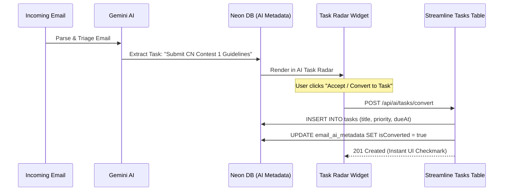

# Gemini AI Intelligence Pipeline

Streamline integrates Google's **Gemini Foundation Models** via the official `@google/genai` SDK to transform static emails and notifications into an actionable personal intelligence hub.

---

## 1. Multi-Model Cascade Architecture

To ensure high availability, fast response times, and resilience against upstream rate limits or outages, Streamline implements a configurable **Multi-Model Cascade Engine**.

```mermaid
graph TD
    Request["Incoming AI Request (Triage / Reply / Digest)"] --> Model1["Primary: gemini-3.5-flash-lite"]
    Model1 -->|Success (200 OK)| Result["Structured JSON / SSE Stream"]
    Model1 -->|Rate Limit / Error| Model2["Fallback 1: gemini-3.6-flash"]
    Model2 -->|Success| Result
    Model2 -->|Rate Limit / Error| Model3["Fallback 2: gemini-3.1-flash-lite"]
    Model3 -->|Success| Result
    Model3 -->|Rate Limit / Error| Model4["Fallback 3: gemini-3.7-flash"]
    Model4 -->|Success| Result
    Model4 -->|All Candidates Failed| Heuristic["Deterministic Heuristic Fallback Engine"]
    Heuristic --> Result
```

### Model Roles & Tiering:
* **`gemini-3.5-flash-lite`**: Primary lightweight model utilized for real-time triage and streaming reply generation.
* **`gemini-3.6-flash`**: Secondary model utilized for comprehensive newsletter synthesis and deep thread summaries.
* **`Deterministic Heuristics`**: Rule-based fallback parsing to ensure email classification proceeds reliably even when external AI endpoints are unreachable.

---

## 2. Core AI Capabilities

### A. Real-Time Email Triage & Classification
Whenever an email is ingested from Google, the `ai-email-triage-queue` passes the message body, sender, and recipient metadata to Gemini with a strict JSON schema contract:

```typescript
// Structured Schema for Gemini Output
{
  priority: "p1_urgent" | "p2_important" | "p3_updates" | "p4_newsletter" | "p5_low",
  urgencyScore: number, // 1 to 100
  category: "action_required" | "direct_message" | "notification" | "newsletter" | "receipt",
  oneSentenceSummary: string,
  newsletterTopic: "🎓 Academics" | "🚀 Tech & AI" | "💼 DevClub" | "👥 Community" | "📊 Finance",
  sentiment: "positive" | "neutral" | "negative",
  extractedTasks: [
    {
      id: string,
      title: string,
      priority: "high" | "medium" | "low",
      dueDate: string | null
    }
  ]
}
```

### B. Streaming AI Reply Drafter
* **Streaming Protocol**: Utilizes Server-Sent Events (`text/event-stream`) for progressive token delivery directly to the client interface.
* **Context Awareness**: Gathers the entire thread history (all prior sender/recipient turns) so Gemini drafts contextual replies matching the active thread conversation.
* **Tone Modulation**:
  * **Professional**: Formal, direct, and action-oriented.
  * **Friendly**: Warm, conversational, and enthusiastic.
  * **Concise**: 1-2 sentence quick acknowledgement and decision.
  * **Custom Instructions**: Freeform user prompt (e.g., *"Accept the meeting for Thursday 2 PM but ask for the agenda beforehand"*).

### C. Daily Executive & Newsletter Digest
Every morning (configurable in Settings), the `daily-digest-cron-queue` aggregates all newsletters, promotional subscriptions, and urgent action items received over the last 24 hours.

Gemini generates a structured executive briefing containing:
1. **Executive Greeting**: A situational awareness opening summary.
2. **Operational Schedule Summary**: High-level readiness context.
3. **Thematic Newsletter Clusters**: Groups incoming newsletters into topic tabs (e.g. *Tech & AI*, *Academics*, *Community*) with bullet points and source links.
4. **Action Item Radar**: Consolidates open deliverables requiring user decision.

---

## 3. AI Task Radar & 1-Click Task Conversion


