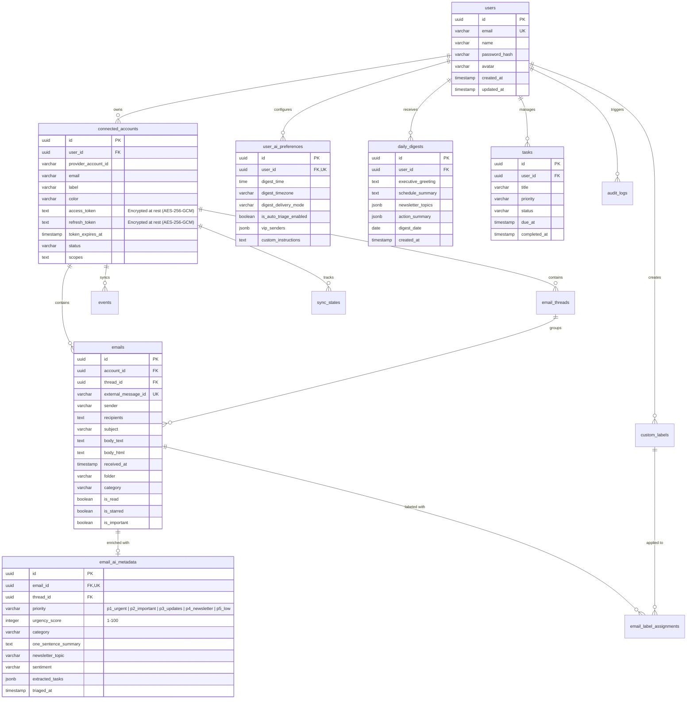

# Database Architecture & Data Models

Streamline utilizes **Neon Serverless PostgreSQL** paired with **Drizzle ORM** for type-safe schema definitions, relationships, and ultra-fast migrations.

---

## 1. Entity-Relationship (ER) Diagram

---

## 2. Table Specifications & Column Dictionary

### `users`
Represents the primary user of the Streamline OS.
* `id` (`uuid`, PK): Unique user identifier.
* `email` (`varchar(255)`, Unique): User login email.
* `name` (`varchar(255)`): Full display name.
* `passwordHash` (`varchar(255)`): Bcrypt hash with cost factor 10.
* `avatar` (`varchar(512)`): Profile photo URL.

### `connected_accounts`
Google Workspace accounts connected by the user.
* `userId` (`uuid`, FK -> `users.id` ON DELETE CASCADE): Owner of the mailbox.
* `providerAccountId` (`varchar(255)`): Google User ID (`sub`).
* `accessToken` (`text`): **AES-256-GCM encrypted** access token.
* `refreshToken` (`text`): **AES-256-GCM encrypted** long-lived refresh token.
* `tokenExpiresAt` (`timestamp`): Expiration timestamp for automatic rotation.
* `status` (`varchar(50)`): `'active' | 'error' | 'disconnected'`.

### `emails`
Synchronized email messages ingested from Gmail API.
* `accountId` (`uuid`, FK -> `connected_accounts.id` ON DELETE CASCADE).
* `threadId` (`uuid`, FK -> `email_threads.id` ON DELETE CASCADE).
* `externalMessageId` (`varchar(255)`, Unique per account): Gmail Message ID.
* `folder` (`varchar(50)`): `'inbox' | 'sent' | 'drafts' | 'trash' | 'archive'`.
* `category` (`varchar(50)`): `'primary' | 'promotions' | 'social' | 'updates'`.
* `attachments` (`jsonb`): List of attachment metadata (filename, size, mimeType).

### `email_ai_metadata`
AI triage and analysis generated by **Google Gemini**.
* `emailId` (`uuid`, Unique, FK -> `emails.id` ON DELETE CASCADE).
* `priority` (`varchar(50)`):
  * `p1_urgent`: Immediate action items & deadlines.
  * `p2_important`: Direct 1-on-1 human conversations.
  * `p3_updates`: System notifications, policy updates, contest details.
  * `p4_newsletter`: Promotional digests, product updates, newsletters.
* `urgencyScore` (`integer`): Computed urgency rating from 1 to 100.
* `oneSentenceSummary` (`text`): Concise summary generated by Gemini Flash.
* `newsletterTopic` (`varchar(100)`): Semantic topic tag (`🎓 Academics`, `🚀 Tech & AI`, `💼 DevClub`, `👥 Community`).
* `extractedTasks` (`jsonb`): Actionable tasks with schema `[{ id, title, priority, dueDate, isConverted, isDismissed }]`.

### `daily_digests`
Daily executive briefings generated by Gemini synthesized across newsletters and high-priority messages.
* `userId` (`uuid`, FK -> `users.id` ON DELETE CASCADE).
* `executiveGreeting` (`text`): Tailored morning briefing statement.
* `scheduleSummary` (`text`): High-level operational readiness summary.
* `newsletterTopics` (`jsonb`): Array of `{ topic, headline, bulletPoints, sourceEmailIds, sentiment }`.
* `actionSummary` (`jsonb`): Array of `{ task, from, emailId, urgency }`.

---

## 3. Database Indexes & Query Optimization

| Table | Index Columns | Purpose |
| :--- | :--- | :--- |
| `emails` | `(account_id, folder, received_at DESC)` | High-speed inbox list retrieval and pagination. |
| `emails` | `(thread_id, received_at ASC)` | Thread view message ordering. |
| `email_ai_metadata` | `(email_id)` (Unique Index) | Sub-millisecond join with `emails` table. |
| `email_ai_metadata` | `(priority, urgency_score DESC)` | High-priority query filtering and radar task generation. |
| `daily_digests` | `(user_id, digest_date DESC)` | Instant dashboard digest fetching. |
| `connected_accounts` | `(user_id, status)` | Fast active account lookup during cron sync. |
