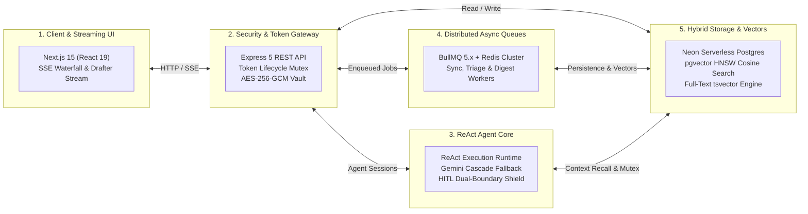
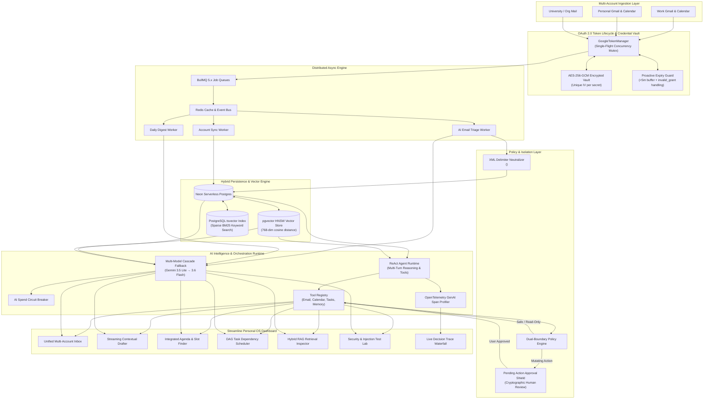
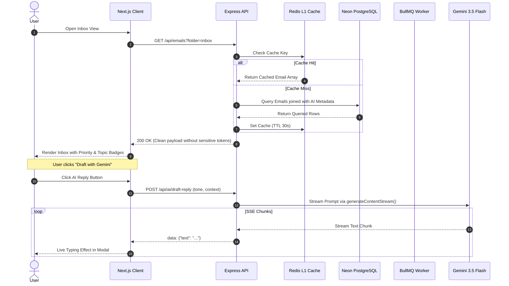

# System Architecture & Overview

Streamline is architected as a modular, event-driven personal productivity platform designed for background data synchronization, decoupled processing, and autonomous AI-assisted workflow orchestration.

---

## 1. System Architecture

### 1.1 Tier 1: 5-Box Executive Architecture (10-Second High-Level Scan)

For portfolios, executive reviews, and initial architectural screening, Streamline decomposes into 5 decoupled subsystems:



---

### 1.2 Tier 2: Deep-Dive Distributed Systems Topology & Dataflows



---

### 1.3 OAuth 2.0 Multi-Account Token Lifecycle & Concurrency Protocol

To prevent **thundering herd race conditions** when concurrent BullMQ workers (e.g. parallel Gmail Sync, Calendar Sync, and Contacts Sync) simultaneously access an account whose access token is expiring, `GoogleTokenManager` enforces an in-memory single-flight promise mutex:

```mermaid
sequenceDiagram
    autonumber
    participant W1 as BullMQ Gmail Worker
    participant W2 as BullMQ Calendar Worker
    participant TM as GoogleTokenManager
    participant Vault as AES-256-GCM Vault
    participant Google as Google OAuth API
    participant DB as Neon PostgreSQL

    W1->>TM: getValidOAuth2Client(accountId)
    W2->>TM: getValidOAuth2Client(accountId)
    Note over TM: Evaluates tokenExpiresAt < (now + 5m)
    TM->>Vault: Decrypt Refresh Token
    Note over TM: W1 acquires activeOperations lock for accountId
    Note over TM: W2 detects in-flight lock; joins existing promise
    TM->>Google: POST /oauth2/v4/token (refresh_token grant)
    Google-->>TM: 200 OK (new access_token, expiry)
    TM->>Vault: Re-encrypt Access Token (AES-256-GCM)
    TM->>DB: UPDATE connected_accounts SET access_token = enc, token_expires_at = newDate
    TM-->>W1: Authenticated OAuth2Client
    TM-->>W2: Authenticated OAuth2Client (Single API Call Made)
```

---

### 1.4 Show Me The Code: Interview Follow-Up Defense Matrix

| Architecture Box Name | What Does This Actually Do? | Production Code Location | Interviewer Follow-Up Defense |
| :--- | :--- | :--- | :--- |
| **OAuth 2.0 Token Lifecycle & Refresh Mutex** | Manages Google multi-account credentials, proactive refresh buffer (<5m), and serialized concurrency locking. | [`token-manager.service.ts`](file:///Users/piyush./Desktop/Streamline/server/src/services/google/token-manager.service.ts) | Prevents thundering herd refresh storms across parallel BullMQ workers; handles `invalid_grant` with automatic status downgrades and audit logging. |
| **ReAct Agent Runtime & Tool Execution Core** | Multi-turn reasoning loop executing registered operational tools (`gmail`, `calendar`, `tasks`, `memory`) with thought signature parsing. | [`orchestrator.service.ts`](file:///Users/piyush./Desktop/Streamline/server/src/services/ai/agent/orchestrator.service.ts) | Parses Gemini internal reasoning blocks, evaluates max turn guardrails, and pipes live step execution to SSE streams. |
| **Dual-Boundary Policy & HITL Approval Shield** | Intercepts state-mutating operations (`send_email`, `create_calendar_event`, `create_task`) before external execution. | [`policy.ts`](file:///Users/piyush./Desktop/Streamline/server/src/services/ai/agent/policy.ts) | Mutating actions write directly to the `pending_actions` table; Google Workspace API calls are strictly blocked until explicit cryptographic human authorization. |
| **pgvector Hybrid RAG & Semantic Memory Store** | Dense HNSW vector search fused with sparse PostgreSQL tsvector full-text search via Reciprocal Rank Fusion ($k=60$). | [`memory.service.ts`](file:///Users/piyush./Desktop/Streamline/server/src/services/ai/memory/memory.service.ts) | Uses Neon pgvector cosine operator `<=>`; automatically supersedes conflicting memories (`supersededBy`); records access frequencies for decay modeling. |
| **DAG Dependency Scheduler & Urgency Engine** | Deterministic task prioritization via topological graph analysis, cycle detection, and exponential urgency decay. | [`priority.service.ts`](file:///Users/piyush./Desktop/Streamline/server/src/services/priority.service.ts) | Prevents dependency deadlocks with cycle detection; computes transitive downstream impact; factors in Google Calendar free slots for contextual fit. |
| **AI Spend Guard & Circuit Breaker** | Tracks per-user daily token consumption and USD expenditure; trips before vendor quotas are exceeded. | [`cost-guard.service.ts`](file:///Users/piyush./Desktop/Streamline/server/src/services/ai/core/cost-guard.service.ts) | Fallback from primary Gemini models to deterministic local handlers when spend exceeds configured daily limits or provider error rates spike. |

---

## 2. Monorepo Organization

```text
Streamline/
├── client/                     # Next.js 15 Frontend Application
│   ├── src/
│   │   ├── app/                # App Router (Dashboard: inbox, agent, memory, security, calendar, tasks, digest)
│   │   ├── components/         # Reusable UI components (Inbox, Agent Studio, Drafter, Task Radar, Memory)
│   │   ├── hooks/              # Custom React hooks
│   │   ├── lib/api/            # Typed API client, fetch wrappers, and DTO definitions
│   │   └── providers/          # React Context providers (AuthContext, ThemeContext)
│   ├── public/                 # Static assets and icons
│   └── package.json
│
├── server/                     # Node.js + Express + BullMQ Backend
│   ├── evals/                  # Automated scenario-based AI evaluation harness
│   │   ├── scenarios/          # Ground-truth JSON test cases (priority, tool, memory, injection)
│   │   ├── runner.ts           # Asynchronous eval runner
│   │   └── run-all.ts          # Master evaluation execution script
│   ├── scripts/                # Utility scripts (injection demo, pgvector test, seed clean)
│   ├── src/
│   │   ├── config/             # Environment validation with Zod
│   │   ├── controllers/        # REST route controllers (Agent, Auth, Accounts, Emails, Events, Tasks, etc.)
│   │   ├── db/                 # Database connection, migrations, and schema definitions
│   │   │   └── schema/         # Drizzle schemas (users, accounts, emails, agent, memories, tasks, ai)
│   │   ├── middlewares/        # Security headers, auth, rate limiting, validation
│   │   ├── queues/             # BullMQ queue instances and Redis connection factory
│   │   ├── repositories/       # Database access layer (Drizzle ORM queries)
│   │   ├── routes/             # Express API routing tables
│   │   ├── schemas/            # Zod validation schemas for requests
│   │   ├── services/           # Business logic & integrations
│   │   │   ├── ai/             # Agent orchestrator, policy engine, tools, memory, features, core providers
│   │   │   ├── google/         # Gmail, Calendar sync, and GoogleTokenManager (singleflight mutex & expiry buffer)
│   │   │   ├── planner.service.ts  # DAG dependency and exponential urgency scoring
│   │   │   └── trace.service.ts    # OpenTelemetry trace assembler & live SSE stream
│   │   ├── utils/              # Crypto (AES-256-GCM), Logger (Pino), OAuth helpers, Redactor
│   │   └── workers/            # BullMQ background workers and cron schedulers
│   ├── package.json
│   └── vitest.config.ts
│
├── docs/                       # Comprehensive Architecture, Security, API & Developer Docs
│   └── adr/                    # Architecture Decision Records (ADR-0001 to ADR-0012)
└── .env.example                # Root environment template
```

---

## 3. Core Architectural Principles

### A. Separation of Concerns & Independent Failure Domains
* **Real-time API Traffic**: Kept lightweight and fast. Expensive synchronization operations never run in the HTTP request cycle; they are dispatched to background queues.
* **Background Workers**: Split by concern (`account-sync-queue`, `ai-email-triage-queue`, `daily-digest-cron-queue`). An unexpected rate limit or timeout during email parsing does not block real-time user browsing or AI draft generation.

### B. Outbox & Idempotency Patterns
* All Gmail sync ingestion jobs use deterministic idempotency keys:
  $$\text{idempotencyKey} = \text{sha256}(\text{accountId} + \text{externalMessageId})$$
* Database insertions utilize `ON CONFLICT (account_id, external_message_id) DO NOTHING`, ensuring duplicate Google sync events collapse gracefully without duplicate entries or state corruption.

### C. Layered Caching Architecture
* **L1 Application Cache (Redis)**: Frequently accessed inbox query pages (`emails:userId:folder:page:limit`) are cached with short TTLs (30s).
* **Cache Invalidation**: State-changing actions (mark as read, toggle star, category update, trash, send email) automatically invalidate the matching user cache keys (`emails:userId:*`).

---

## 4. Request Lifecycle & Data Flow


