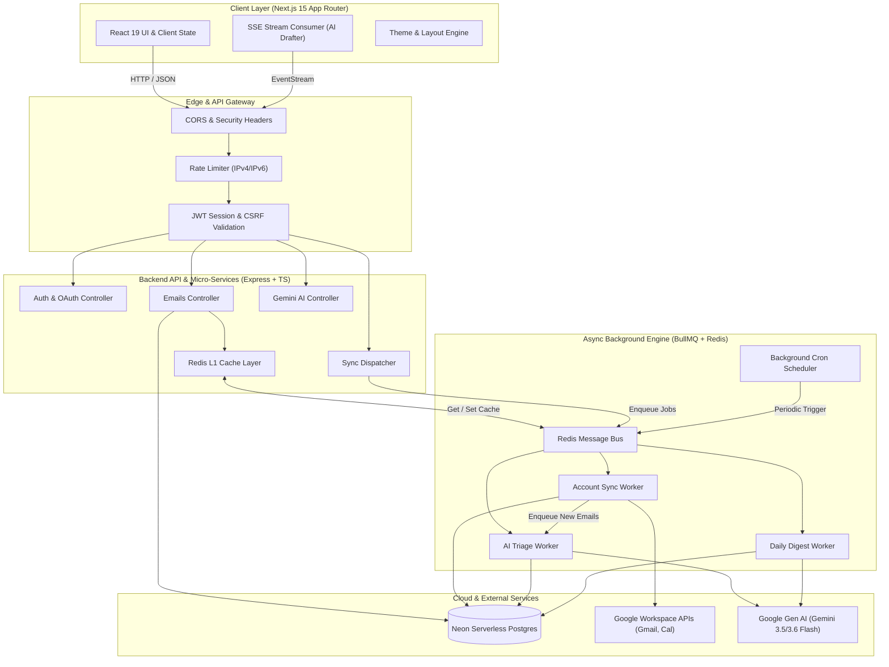
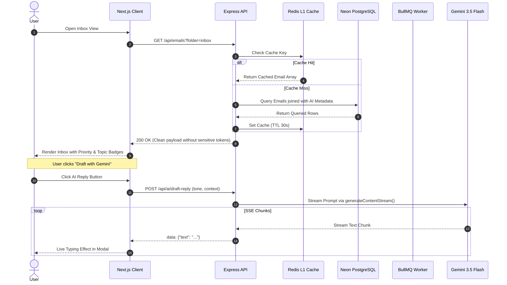

# System Architecture & Overview

Streamline is architected as a modular, event-driven personal productivity platform designed for background data synchronization, decoupled processing, and autonomous AI-assisted workflow orchestration.

---

## 1. High-Level System Topology



---

## 2. Monorepo Organization

```text
Streamline/
├── client/                     # Next.js 15 Frontend Application
│   ├── src/
│   │   ├── app/                # App Router (Dashboard: inbox, agent, memory, security, calendar, tasks, digest)
│   │   ├── components/         # Reusable UI components (Inbox, Agent Studio, Drafter, Task Radar, Memory)
│   │   ├── hooks/              # Custom React hooks
│   │   ├── lib/api/            # Typed API client, fetch wrappers, and DTO definitions
│   │   └── providers/          # React Context providers (AuthContext, ThemeContext)
│   ├── public/                 # Static assets and icons
│   └── package.json
│
├── server/                     # Node.js + Express + BullMQ Backend
│   ├── evals/                  # Automated scenario-based AI evaluation harness
│   │   ├── scenarios/          # Ground-truth JSON test cases (priority, tool, memory, injection)
│   │   ├── runner.ts           # Asynchronous eval runner
│   │   └── run-all.ts          # Master evaluation execution script
│   ├── scripts/                # Utility scripts (injection demo, pgvector test, seed clean)
│   ├── src/
│   │   ├── config/             # Environment validation with Zod
│   │   ├── controllers/        # REST route controllers (Agent, Auth, Accounts, Emails, Events, Tasks, etc.)
│   │   ├── db/                 # Database connection, migrations, and schema definitions
│   │   │   └── schema/         # Drizzle schemas (users, accounts, emails, agent, memories, tasks, ai)
│   │   ├── middlewares/        # Security headers, auth, rate limiting, validation
│   │   ├── queues/             # BullMQ queue instances and Redis connection factory
│   │   ├── repositories/       # Database access layer (Drizzle ORM queries)
│   │   ├── routes/             # Express API routing tables
│   │   ├── schemas/            # Zod validation schemas for requests
│   │   ├── services/           # Business logic & integrations
│   │   │   ├── ai/             # Agent orchestrator, policy engine, tools, memory, features, core providers
│   │   │   ├── google/         # Gmail, Calendar sync services, and token rotation
│   │   │   ├── planner.service.ts  # DAG dependency and exponential urgency scoring
│   │   │   └── trace.service.ts    # OpenTelemetry trace assembler & live SSE stream
│   │   ├── utils/              # Crypto (AES-256-GCM), Logger (Pino), OAuth helpers, Redactor
│   │   └── workers/            # BullMQ background workers and cron schedulers
│   ├── package.json
│   └── vitest.config.ts
│
├── docs/                       # Comprehensive Architecture, Security, API & Developer Docs
│   └── adr/                    # Architecture Decision Records (ADR-0001 to ADR-0012)
└── .env.example                # Root environment template
```

---

## 3. Core Architectural Principles

### A. Separation of Concerns & Independent Failure Domains
* **Real-time API Traffic**: Kept lightweight and fast. Expensive synchronization operations never run in the HTTP request cycle; they are dispatched to background queues.
* **Background Workers**: Split by concern (`account-sync-queue`, `ai-email-triage-queue`, `daily-digest-cron-queue`). An unexpected rate limit or timeout during email parsing does not block real-time user browsing or AI draft generation.

### B. Outbox & Idempotency Patterns
* All Gmail sync ingestion jobs use deterministic idempotency keys:
  $$\text{idempotencyKey} = \text{sha256}(\text{accountId} + \text{externalMessageId})$$
* Database insertions utilize `ON CONFLICT (account_id, external_message_id) DO NOTHING`, ensuring duplicate Google sync events collapse gracefully without duplicate entries or state corruption.

### C. Layered Caching Architecture
* **L1 Application Cache (Redis)**: Frequently accessed inbox query pages (`emails:userId:folder:page:limit`) are cached with short TTLs (30s).
* **Cache Invalidation**: State-changing actions (mark as read, toggle star, category update, trash, send email) automatically invalidate the matching user cache keys (`emails:userId:*`).

---

## 4. Request Lifecycle & Data Flow


