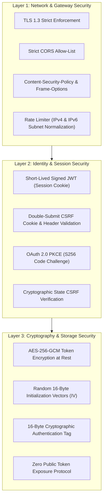

# Security, Authentication & Token Encryption

Streamline is designed with a defense-in-depth security architecture to ensure sensitive Google OAuth credentials, emails, and calendar data are protected at every layer.

---

## 1. Security Architecture Layers



---

## 2. AES-256-GCM Token Encryption at Rest

All Google `accessToken` and `refreshToken` values are encrypted using **AES-256-GCM (Galois/Counter Mode)** before being written to the database.

### Encryption Implementation (`server/src/utils/encryption.ts`):
```typescript
export function encrypt(text: string): string {
  const iv = crypto.randomBytes(16);
  const cipher = crypto.createCipheriv('aes-256-gcm', key, iv);
  let encrypted = cipher.update(text, 'utf8', 'hex');
  encrypted += cipher.final('hex');
  const authTag = cipher.getAuthTag().toString('hex');
  // Format: iv:authTag:encryptedPayload
  return `${iv.toString('hex')}:${authTag}:${encrypted}`;
}
```

* **Authentication Tag Verification**: Guarantees ciphertext integrity; any tampering with database values causes immediate decryption failure.
* **Random IV per Operation**: Ensures identical plaintext tokens produce completely distinct ciphertexts.

---

## 3. Zero Public Token Exposure Protocol

Sensitive credentials (`accessToken`, `refreshToken`, cryptographic hashes) are strictly isolated to backend background workers and **never serialized in public API endpoints**:

```typescript
// Sanitized Account Query in AccountsRepository
async findByUserId(userId: string) {
  return db.select({
    id: connectedAccounts.id,
    providerAccountId: connectedAccounts.providerAccountId,
    email: connectedAccounts.email,
    label: connectedAccounts.label,
    color: connectedAccounts.color,
    avatar: connectedAccounts.avatar,
    status: connectedAccounts.status,
    scopes: connectedAccounts.scopes,
    createdAt: connectedAccounts.createdAt,
    updatedAt: connectedAccounts.updatedAt,
  })
  .from(connectedAccounts)
  .where(eq(connectedAccounts.userId, userId));
}
```

---

## 4. Google OAuth 2.0 with PKCE & State Protection

* **Proof Key for Code Exchange (PKCE)**: Uses `SHA-256` code challenges (`S256`) to prevent authorization code interception attacks.
* **State Parameter Verification**: Embeds authenticated user session verification in the `state` parameter to prevent cross-site request forgery during OAuth callbacks.
* **Refresh Token Preservation**: Prevents overwriting valid long-lived refresh tokens when repeat Google consent flows omit a new refresh token.

### 4.1 OAuth Token Lifecycle & Concurrency Mutex (`GoogleTokenManager`)

Multi-account background synchronization (Gmail sync, Calendar sync, Contacts sync) frequently executes in parallel across decoupled BullMQ worker threads. If an account's token is near expiry, multiple concurrent workers could simultaneously trigger token refresh calls against Google's OAuth endpoints.

To guarantee zero race conditions and eliminate token churn:
1. **Proactive 5-Minute Expiry Buffer**: `GoogleTokenManager` tests if `tokenExpiresAt < Date.now() + 5 * 60 * 1000`. Tokens are refreshed before long-running batch operations start, preventing mid-flight `401 Unauthorized` errors.
2. **Single-Flight Concurrency Mutex**: An in-memory promise map keyed by `accountId` (`activeOperations`) intercepts concurrent requests for the same account. The first caller initiates the Google refresh request; subsequent callers synchronously join and await the identical in-flight promise.
3. **Terminal Error Recovery**: Catches `invalid_grant` or revoked token responses, automatically marking `connectedAccounts.status = 'error'` and `syncStates.status = 'error'`, triggering an audit alert for user re-authentication without crashing worker pipelines.

---

## 5. Threat Model & Mitigation Matrix

| Threat | Impact | Streamline Mitigation Strategy |
| :--- | :--- | :--- |
| **Database Compromise** | Exposure of Google tokens | **AES-256-GCM Encryption**: Tokens are stored as unreadable ciphertexts requiring the out-of-band `ENCRYPTION_KEY`. |
| **Cross-Site Scripting (XSS)** | Session hijacking | **`httpOnly`, `SameSite=Strict` Cookies**: JavaScript cannot access session tokens. |
| **Cross-Site Request Forgery (CSRF)** | Unauthorized actions | **Double-Submit CSRF Protection**: State-changing endpoints require matching `x-csrf-token` headers. |
| **Clickjacking** | UI redress attacks | **`X-Frame-Options: DENY`**: Browser denies iframe embedding of the Streamline web app. |
| **Credential Stuffing / DoS** | Server exhaustion | **IPv4 & IPv6 Subnet Normalized Rate Limiting**: Enforces strict request caps per IP window. |
