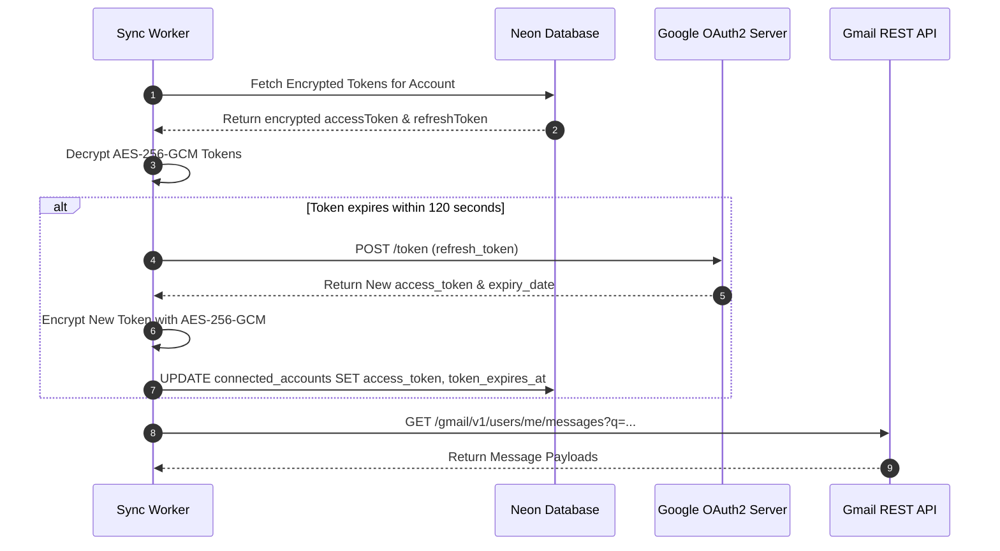

# Sync Engine & BullMQ Workers

Streamline's synchronization engine is built for reliable, asynchronous data ingestion across multiple Google accounts with zero impact on UI responsiveness.

---

## 1. Background Worker Architecture

```mermaid
graph LR
    subgraph Schedulers ["Schedulers (Cron & Triggers)"]
        Cron2Min["2-Minute Account Sync Cron"]
        CronDaily["Daily Digest Scheduler (8:00 AM)"]
        ManualTrigger["User Manual Trigger / Login Hook"]
    end

    subgraph Queues ["BullMQ Queue Bus (Redis)"]
        Q_Sync["account-sync-queue (Concurrency: 2)"]
        Q_Triage["ai-email-triage-queue (Concurrency: 3)"]
        Q_Digest["daily-digest-cron-queue (Concurrency: 1)"]
    end

    subgraph Handlers ["Worker Processors"]
        W_Sync["gmail-sync.service.ts"]
        W_Triage["ai-triage.worker.ts"]
        W_Digest["daily-digest.worker.ts"]
    end

    Cron2Min -->|Enqueue { accountId }| Q_Sync
    ManualTrigger -->|Enqueue { accountId }| Q_Sync
    CronDaily -->|Enqueue { userId }| Q_Digest

    Q_Sync --> W_Sync
    W_Sync -->|Enqueue New Email IDs| Q_Triage
    Q_Triage --> W_Triage
    Q_Digest --> W_Digest
```

---

## 2. Google OAuth Token Lifecycle & Auto-Rotation

Google access tokens expire every **60 minutes (3,600 seconds)**. Streamline manages continuous token freshness transparently in `getGmailClientForAccount`:



### Grant Revocation Detection
If a user revokes Streamline permissions from their Google Security page, Google returns `invalid_grant (400/401)`.
* Streamline intercepts `invalid_grant` immediately.
* Updates `connected_accounts.status = 'error'`.
* Logs an immutable security audit event `account.token_revocation_error`.
* Prevents hammering Google APIs with expired credentials.

---

## 3. Worker Queue Specifications

| Queue Name | Concurrency | Backoff Policy | Retention | Purpose |
| :--- | :--- | :--- | :--- | :--- |
| **`account-sync-queue`** | `2` | Exponential (2,000 ms) | 1 hour completed, 24 hours failed | Incremental email and calendar polling. |
| **`ai-email-triage-queue`** | `3` | Exponential (3,000 ms) | 1 hour completed, 24 hours failed | Gemini batch email triage and task extraction. |
| **`daily-digest-cron-queue`** | `1` | Exponential (5,000 ms) | 2 hours completed, 24 hours failed | Daily newsletter synthesis and morning briefings. |

---

## 4. Incremental Sync Strategy

1. **History ID / Time-Scoped Ingestion**: Queries Gmail for messages using query filters: `after:START_DATE`.
2. **Batch Chunking**: Syncs messages in chunks of 50.
3. **Idempotent Insertion**:
   ```sql
   INSERT INTO emails (account_id, external_message_id, sender, subject, ...)
   VALUES ($1, $2, $3, $4, ...)
   ON CONFLICT (account_id, external_message_id) DO NOTHING;
   ```
4. **Auto-Enqueue for AI**: Newly inserted email IDs are collected into an array and automatically pushed to `ai-email-triage-queue` for Gemini classification.
